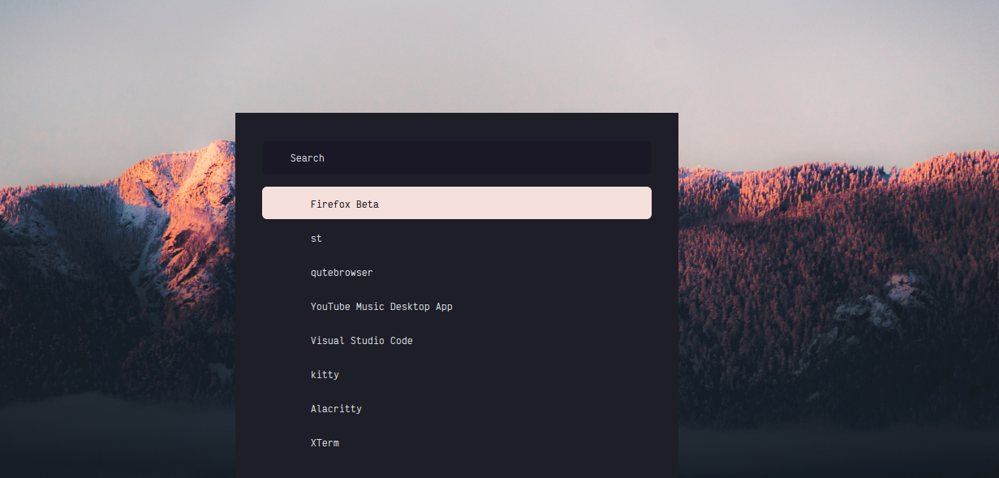

<h3 align="center">
	 
	
	Catppuccin for Rofi
	
</h3>

    
    
    

  

## Usage

1. Clone this repository locally
2. Copy `catppucin.rasi` to `~/.config/rofi/config.rasi`

## 💝 Thanks to

- [Astro](https://github.com/astro)
